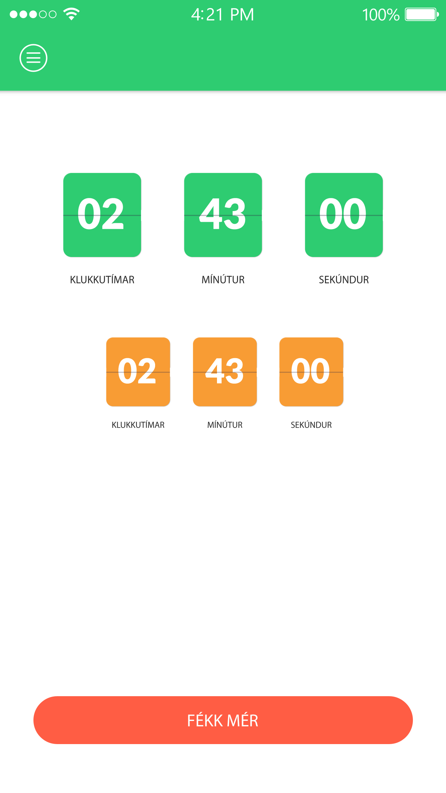

# Hættu Nú Alveg

Þinn aðstoðarmaður við að hætta að bagga.
Forritað 2016.

English below.

## Keyrsla

Keyrist á einfaldan máta í Android Studio

## Hnotskurn hugmyndar

	
	
	
	
	
	

## English

This application, developed in 2016, was inspired by an idea of a friend of mine, who was having a hard time quitting dipping.

